# 🗂️ Bug2Build — Entity-Relationship Model

> Derived from the 10 Mongoose schemas in `server/models/` and the project README.
> Database: **MongoDB Atlas** via **Mongoose 9.x ODM**

---

## ER Diagram

```mermaid
erDiagram
    USER {
        ObjectId _id PK
        String name "required, max 100"
        String email UK "required, unique, lowercase"
        String password "required, min 8"
        String role "enum: admin | superadmin"
        String profilePicture "Cloudinary URL"
        String bio "max 500"
        Boolean isActive "default: true"
        Date createdAt
        Date updatedAt
    }

    EVENT {
        ObjectId _id PK
        String title "required, max 200"
        String description "text-indexed"
        Date date "required"
        String location
        String category "enum: workshop | hackathon | meetup | webinar | conference | other"
        String status "enum: upcoming | ongoing | past"
        Boolean published "default: true"
        String eventLink
        String image "legacy single image"
        String coverImage "Cloudinary URL"
        ObjectId createdBy FK "ref: User"
        Date createdAt
        Date updatedAt
    }

    GALLERY_IMAGE {
        ObjectId _id PK
        String url "required, Cloudinary URL"
        String publicId "required, Cloudinary ID"
        String altText
        Number order "default: 0"
    }

    TEAM_MEMBER {
        ObjectId _id PK
        String name "required, max 100"
        String role "required, max 100"
        String photo "Cloudinary URL"
        String linkedin
        String github
        String category "enum: executive | tech | event | sponsors | digital_media | marketing | research"
        Number order "default: 0"
        Boolean isActive "default: true"
        Date createdAt
        Date updatedAt
    }

    PARTNER {
        ObjectId _id PK
        String name "required, max 150"
        String logo "Cloudinary URL"
        String website
        String category
        Boolean isActive "default: true"
        Date createdAt
        Date updatedAt
    }

    BRAND {
        ObjectId _id PK
        String name "required, max 150"
        String logo "Cloudinary URL"
        String website
        Boolean isActive "default: true"
        Date createdAt
        Date updatedAt
    }

    CONTRIBUTOR {
        ObjectId _id PK
        String name "required, max 100"
        String github
        String role
        String avatar "Cloudinary URL"
        String bio "max 300"
        Boolean isActive "default: true"
        Date createdAt
        Date updatedAt
    }

    SITE_CONTENT {
        ObjectId _id PK
        String key UK "required, unique"
        String value "CMS text content"
        ObjectId updatedBy FK "ref: User"
        Date createdAt
        Date updatedAt
    }

    CONTACT_SUBMISSION {
        ObjectId _id PK
        String name "required, max 100"
        String email "required"
        String subject "max 200"
        String message "required, max 2000"
        Boolean isRead "default: false"
        Date createdAt
        Date updatedAt
    }

    ACTIVITY_LOG {
        ObjectId _id PK
        ObjectId user FK "required, ref: User"
        String action "required"
        String ip
        Date timestamp "default: now"
    }

    CHAT_SESSION {
        ObjectId _id PK
        String sessionId "required, indexed"
        Date createdAt
        Date updatedAt
    }

    CHAT_MESSAGE {
        ObjectId _id PK
        String role "enum: user | assistant | system"
        String content "required"
        Date timestamp "default: now"
    }

    %% ── Relationships ──

    USER ||--o{ EVENT : "creates"
    USER ||--o{ ACTIVITY_LOG : "performs"
    USER ||--o| SITE_CONTENT : "last updated by"
    EVENT ||--|{ GALLERY_IMAGE : "contains (embedded, max 10)"
    CHAT_SESSION ||--|{ CHAT_MESSAGE : "contains (embedded)"
```

---

## Entity Details

### 1. User
> [User.js](file:///c:/MERN%20STACK/9%20-%20COURSE%20PROJECTS/B2B/server/models/User.js) — Admin and SuperAdmin accounts

| Field | Type | Constraints |
|-------|------|-------------|
| `_id` | ObjectId | PK, auto-generated |
| `name` | String | **required**, max 100, trimmed |
| `email` | String | **required**, **unique**, lowercase, trimmed, regex-validated |
| `password` | String | **required**, min 8 chars, bcrypt-hashed (salt: 12) |
| `role` | String | `enum: ['admin', 'superadmin']`, default `'admin'` |
| `profilePicture` | String | Cloudinary URL, default `''` |
| `bio` | String | max 500, default `''` |
| `isActive` | Boolean | default `true` |
| `createdAt` | Date | auto (timestamps) |
| `updatedAt` | Date | auto (timestamps) |

**Indexes:** `{ role: 1, isActive: 1 }`

---

### 2. Event
> [Event.js](file:///c:/MERN%20STACK/9%20-%20COURSE%20PROJECTS/B2B/server/models/Event.js) — Community events with a gallery sub-document array

| Field | Type | Constraints |
|-------|------|-------------|
| `_id` | ObjectId | PK |
| `title` | String | **required**, max 200, trimmed, text-indexed |
| `description` | String | trimmed, text-indexed |
| `date` | Date | **required** |
| `location` | String | trimmed |
| `category` | String | `enum: ['workshop','hackathon','meetup','webinar','conference','other']` |
| `status` | String | `enum: ['upcoming','ongoing','past']`, default `'upcoming'` |
| `published` | Boolean | default `true` |
| `eventLink` | String | trimmed |
| `image` | String | Legacy single-image field (backward compat) |
| `gallery` | [GalleryImage] | **Embedded array**, max 10 items |
| `coverImage` | String | Cloudinary URL |
| `createdBy` | ObjectId | **FK → User** |
| `createdAt` | Date | auto |
| `updatedAt` | Date | auto |

**Indexes:** `{ date: -1 }`, `{ status: 1 }`, `{ published: 1 }`, `{ title: 'text', description: 'text' }`

#### Embedded: GalleryImage

| Field | Type | Constraints |
|-------|------|-------------|
| `_id` | ObjectId | Auto-generated (`_id: true`) |
| `url` | String | **required** — Cloudinary URL |
| `publicId` | String | **required** — Cloudinary public ID |
| `altText` | String | default `''` |
| `order` | Number | default `0` |

---

### 3. TeamMember
> [TeamMember.js](file:///c:/MERN%20STACK/9%20-%20COURSE%20PROJECTS/B2B/server/models/TeamMember.js) — Org team members with department categories

| Field | Type | Constraints |
|-------|------|-------------|
| `_id` | ObjectId | PK |
| `name` | String | **required**, max 100 |
| `role` | String | **required**, max 100 (designation, not auth role) |
| `photo` | String | Cloudinary URL |
| `linkedin` | String | trimmed |
| `github` | String | trimmed |
| `category` | String | **required**, `enum: ['executive','tech','event','sponsors','digital_media','marketing','research']` |
| `order` | Number | default `0` |
| `isActive` | Boolean | default `true` |
| `createdAt` / `updatedAt` | Date | auto |

**Indexes:** `{ category: 1, order: 1 }`, `{ isActive: 1 }`

---

### 4. Partner
> [Partner.js](file:///c:/MERN%20STACK/9%20-%20COURSE%20PROJECTS/B2B/server/models/Partner.js) — Partner organization logos

| Field | Type | Constraints |
|-------|------|-------------|
| `_id` | ObjectId | PK |
| `name` | String | **required**, max 150 |
| `logo` | String | Cloudinary URL |
| `website` | String | trimmed |
| `category` | String | trimmed, free-text |
| `isActive` | Boolean | default `true` |
| `createdAt` / `updatedAt` | Date | auto |

**Indexes:** `{ isActive: 1 }`

---

### 5. Brand
> [Brand.js](file:///c:/MERN%20STACK/9%20-%20COURSE%20PROJECTS/B2B/server/models/Brand.js) — Brand logos displayed on the site

| Field | Type | Constraints |
|-------|------|-------------|
| `_id` | ObjectId | PK |
| `name` | String | **required**, max 150 |
| `logo` | String | Cloudinary URL |
| `website` | String | trimmed |
| `isActive` | Boolean | default `true` |
| `createdAt` / `updatedAt` | Date | auto |

**Indexes:** `{ isActive: 1 }`

---

### 6. Contributor
> [Contributor.js](file:///c:/MERN%20STACK/9%20-%20COURSE%20PROJECTS/B2B/server/models/Contributor.js) — Open-source contributors

| Field | Type | Constraints |
|-------|------|-------------|
| `_id` | ObjectId | PK |
| `name` | String | **required**, max 100 |
| `github` | String | trimmed |
| `role` | String | trimmed, free-text |
| `avatar` | String | Cloudinary URL |
| `bio` | String | max 300 |
| `isActive` | Boolean | default `true` |
| `createdAt` / `updatedAt` | Date | auto |

**Indexes:** `{ isActive: 1 }`

---

### 7. SiteContent
> [SiteContent.js](file:///c:/MERN%20STACK/9%20-%20COURSE%20PROJECTS/B2B/server/models/SiteContent.js) — Key-value CMS store for all site text

| Field | Type | Constraints |
|-------|------|-------------|
| `_id` | ObjectId | PK |
| `key` | String | **required**, **unique**, trimmed |
| `value` | String | CMS content (Markdown/text) |
| `updatedBy` | ObjectId | **FK → User** |
| `createdAt` / `updatedAt` | Date | auto |

**Indexes:** `{ key: 1 }` (unique)

---

### 8. ContactSubmission
> [ContactSubmission.js](file:///c:/MERN%20STACK/9%20-%20COURSE%20PROJECTS/B2B/server/models/ContactSubmission.js) — Public contact form entries

| Field | Type | Constraints |
|-------|------|-------------|
| `_id` | ObjectId | PK |
| `name` | String | **required**, max 100 |
| `email` | String | **required**, regex-validated |
| `subject` | String | max 200 |
| `message` | String | **required**, max 2000 |
| `isRead` | Boolean | default `false` |
| `createdAt` / `updatedAt` | Date | auto |

**Indexes:** `{ createdAt: -1 }`, `{ isRead: 1 }`

---

### 9. ActivityLog
> [ActivityLog.js](file:///c:/MERN%20STACK/9%20-%20COURSE%20PROJECTS/B2B/server/models/ActivityLog.js) — Admin action audit trail

| Field | Type | Constraints |
|-------|------|-------------|
| `_id` | ObjectId | PK |
| `user` | ObjectId | **required**, **FK → User** |
| `action` | String | **required**, trimmed |
| `ip` | String | Client IP address |
| `timestamp` | Date | default `Date.now` |

**Indexes:** `{ timestamp: -1 }`, `{ user: 1, timestamp: -1 }`

> [!NOTE]
> ActivityLog does **not** use Mongoose `timestamps` — it has a manual `timestamp` field.

---

### 10. ChatSession
> [ChatSession.js](file:///c:/MERN%20STACK/9%20-%20COURSE%20PROJECTS/B2B/server/models/ChatSession.js) — AI chatbot conversation sessions

| Field | Type | Constraints |
|-------|------|-------------|
| `_id` | ObjectId | PK |
| `sessionId` | String | **required**, indexed |
| `messages` | [ChatMessage] | **Embedded array** |
| `createdAt` / `updatedAt` | Date | auto |

#### Embedded: ChatMessage

| Field | Type | Constraints |
|-------|------|-------------|
| `_id` | ObjectId | Auto-generated |
| `role` | String | **required**, `enum: ['user','assistant','system']` |
| `content` | String | **required** |
| `timestamp` | Date | default `Date.now` |

---

## Relationship Summary

| From | To | Type | Field | Description |
|------|----|------|-------|-------------|
| **Event** | **User** | Many-to-One | `Event.createdBy` | Which admin created the event |
| **SiteContent** | **User** | Many-to-One | `SiteContent.updatedBy` | Last admin/superadmin to update the CMS key |
| **ActivityLog** | **User** | Many-to-One | `ActivityLog.user` | Which admin performed the audited action |
| **Event** | **GalleryImage** | One-to-Many | `Event.gallery[]` | Embedded sub-document array (max 10) |
| **ChatSession** | **ChatMessage** | One-to-Many | `ChatSession.messages[]` | Embedded sub-document array |

> [!IMPORTANT]
> **TeamMember**, **Partner**, **Brand**, **Contributor**, and **ContactSubmission** are **standalone collections** with no foreign-key references to other entities. They are managed independently through the admin CRUD dashboard.

---

## Standalone Entities (No FK References)

These 5 collections are fully independent — no ObjectId references to or from other collections:

| Entity | Purpose | Managed By |
|--------|---------|------------|
| **TeamMember** | Organization team members | Admin |
| **Partner** | Partner organization logos | Admin |
| **Brand** | Brand logos | Admin |
| **Contributor** | Open-source contributors | Admin |
| **ContactSubmission** | Public contact form entries | Admin (read-only) |

---

## Index Overview

| Collection | Index | Type |
|------------|-------|------|
| User | `{ role: 1, isActive: 1 }` | Compound |
| User | `{ email: 1 }` | Unique (schema) |
| Event | `{ date: -1 }` | Descending |
| Event | `{ status: 1 }` | Single |
| Event | `{ published: 1 }` | Single |
| Event | `{ title: 'text', description: 'text' }` | Text |
| TeamMember | `{ category: 1, order: 1 }` | Compound |
| TeamMember | `{ isActive: 1 }` | Single |
| Partner | `{ isActive: 1 }` | Single |
| Brand | `{ isActive: 1 }` | Single |
| Contributor | `{ isActive: 1 }` | Single |
| SiteContent | `{ key: 1 }` | Unique |
| ContactSubmission | `{ createdAt: -1 }` | Descending |
| ContactSubmission | `{ isRead: 1 }` | Single |
| ActivityLog | `{ timestamp: -1 }` | Descending |
| ActivityLog | `{ user: 1, timestamp: -1 }` | Compound |
| ChatSession | `{ sessionId: 1 }` | Single |
